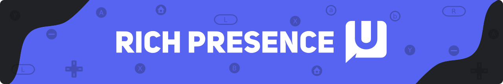
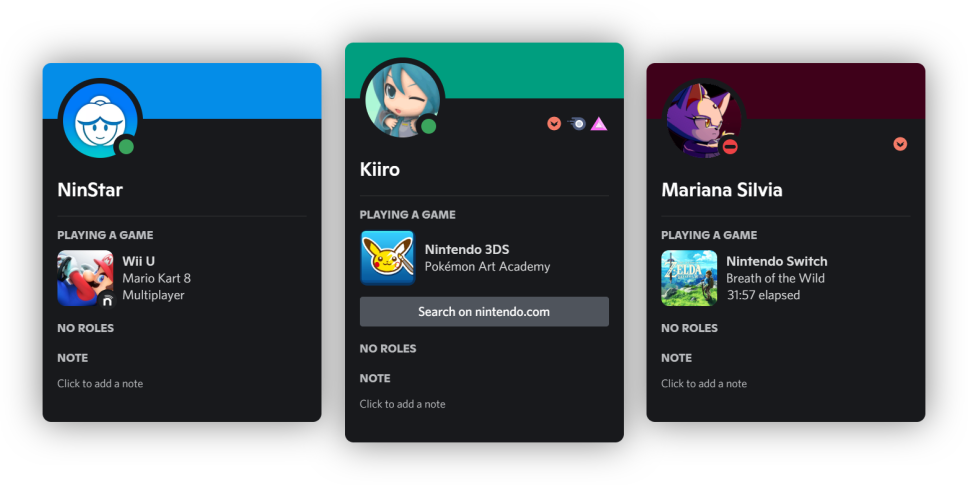
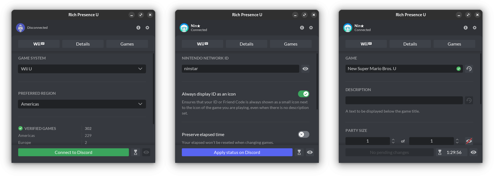

# Overview

A simple application that allows you to create your own activity statuses for Wii U, Nintendo Switch and Nintendo 3DS games and display them on your Discord profile.



## Features

- An ever-growing [collection of titles and icons][database] from multiple regions.
- Various customization options:
	- Game renaming and personalized descriptions.
	- Nintendo Network ID and Friend Code sharing.
	- Elapsed time, party size and more.



> [!Note]
> Automatic activity setup is NOT supported at the moment. Partial or full support may be added in a future major release, implementation will vary from platform to platform.

<p align="center">You can support my work by purchasing this application:</p>
<p align="center"><a href="https://ninstars.itch.io/rpc"></a></p>

# Localize

If you are interested in contributing by translating the project into other languages, you can use the [english.csv][locale_template] as a template.

> [!Important]
> Cells are separated by commas ``,`` and delimited by double quotation marks ``"``. 

- Other translations: [/source/locales][locales]

# Install

1. [Download][zip] the repository or clone it via command line:
```bash
git clone https://github.com/ninstar/Rich-Presence-U.git
```
> Paths starting with a `/` in this guide are relative to where you extracted the .zip or cloned the repository.
2. Get Godot ``3.6-stable (Standard)`` [here][godot].
3. Open Godot, click **Import ➜ Browse**, navigate to ``/source/project.godot``, select the file and click **Import & Edit**.
4. With the project open, access **Editor ➜ Manage Export Templates** and click **Download and Install**.
> If you are having trouble with the **Download and Install** option, you can [download this .tpz file][templates] and install it using the **Install from File** option.
5. After the installation is done, close the **Export Template Manager** window and access **Project ➜ Export**.
6. Click **Add** and select the platform you want to export to (compatible platforms are **Linux/X11**, **Mac OSX** and **Windows Desktop**), then set an **Export Path**.
	- In the **Options** tab, add ``com.ninstar.rpc`` to the **Identifier** field if you selected **Mac OSX**.
	- Optionally fill in the name, icon and other details for the app.
 	- Icons for all supported platforms can be found at ``/source/assets/app``. **rcedit** is required in order to export .exe files with custom icons, follow these instructions to install it:
		1. [Download rcedit-x64.exe][rcedit].
	   	2. Access **Editor ➜ Editor Settings ➜ General** and scroll down to **Export ➜ Windows**.
	   	3. Change **rcedit** to point to the path where ``rcedit-x64.exe`` is located. 
> These configurations are saved at ``/source/export_presets.cfg`` for any eventual reuse.
7. Click **Export All ➜ Release** or use the command line depending on the platform you've made the preset for: 
 ```bash
godot --export "Linux/X11" RichPresenceU
godot --export "Mac OSX" RichPresenceU.dmg
godot --export "Windows Desktop" RichPresenceU.exe
```
> You also have the option to compile [everything][compile] from source.

# Credits

- **Art, Code & Design** - Ny'hrarr (NinStar)
- **Database** - [All contributors](https://github.com/ninstar/Rich-Presence-U-DB#credits)
- **Translations**
	- **Deutsch** - DeeKay-Deluxe
	- **Español** - JhoanLsuper
	- **Français** - Celestial04
	- **Magyar** - Feeniheelo
	- **Nederlands** - Thomanski
	- **Português** - Ny'hrarr (NinStar)

# Third-party code

- [**discord-rpc**](https://github.com/discord/discord-rpc) - Discord
- [**Godot**](https://github.com/godotengine/godot) - Godot Engine 
- [**Godot-UnixSocket**](https://github.com/Abdera7mane/Godot-UnixSocket) - Abdera7mane

[database]: https://github.com/ninstar/Rich-Presence-U-DB
[zip]: https://github.com/ninstar/Rich-Presence-U/archive/refs/heads/main.zip
[godot]: https://godotengine.org/download/archive/3.6-stable/
[templates]: https://github.com/godotengine/godot/releases/download/3.6-stable/Godot_v3.6-stable_export_templates.tpz
[compile]: https://docs.godotengine.org/en/3.6/development/compiling
[locales]: https://github.com/ninstar/Rich-Presence-U/tree/main/source/locales
[locale_template]: https://github.com/ninstar/Rich-Presence-U/tree/main/source/locales/english.csv
[rcedit]: https://github.com/electron/rcedit/releases/download/v2.0.0/rcedit-x64.exe
